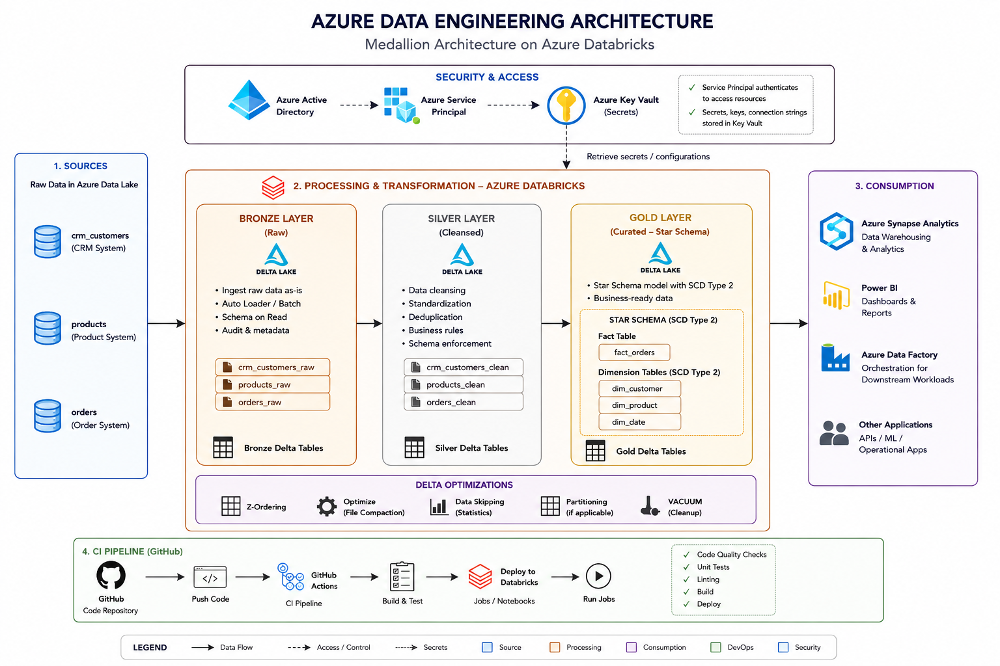

# 🏆 Sales Data Platform — Medallion Architecture (Azure Databricks + Spark + Azure Data Lake)

## Overview

Enterprise-grade Sales Data Platform implementing the **Medallion Architecture** (Bronze → Silver → Gold) on **Azure Databricks** with **Apache Spark** and **Delta Lake**. Data flows from three source systems through cleansed and curated layers into a **Star Schema** with **SCD Type 2**, consumed by Azure Synapse Analytics, Power BI, and downstream applications — all secured via **Azure Active Directory**, **Service Principal**, and **Azure Key Vault**.

---

## Architecture



---

## Security & Access

| Component | Role |
|-----------|------|
| Azure Active Directory | Identity provider — authenticates users and service principals |
| Azure Service Principal | Non-interactive identity used by Databricks to access Azure resources |
| Azure Key Vault (Secrets) | Centralized secrets store — connection strings, keys, and credentials retrieved at runtime |

---

## Project Structure

```
sales_dw_project/
│
├── config/
│   └── config.py               # All configs (paths, schema names, etc.)
│
├── notebooks/
│   ├── 00_setup.py             # Environment setup & database creation
│   ├── 01_bronze_ingestion.py  # Raw data ingestion (3 sources → Bronze)
│   ├── 02_silver_processing.py # Cleansing & standardization (Bronze → Silver)
│   ├── 03_gold_dimensions.py   # Dimension tables with SCD Type 2
│   ├── 04_gold_fact.py         # Fact table construction
│   └── 05_data_quality.py      # DQ checks & audit reports
│
├── utils/
│   ├── spark_utils.py          # Spark session helpers
│   ├── scd_utils.py            # SCD Type 2 merge logic
│   ├── dq_utils.py             # Data quality utilities
│   └── logger.py               # Logging setup
│
├── data/
│   └── source/
│       ├── crm_customers.csv    # Sample CRM data
│       ├── erp_products.csv     # Sample ERP data
│       └── ecom_orders.csv      # Sample E-Commerce data
│
├── tests/
│   └── test_transformations.py  # Unit tests
│
├── docs/
│   └── data_dictionary.md       # Schema documentation
│
└── README.md
```

---

## Data Sources

| Source System | Raw Table | Description |
|---------------|-----------|-------------|
| CRM System | `crm_customers` | Customer records |
| Product System | `products` | Product catalogue |
| Order System | `orders` | Transactional order data |

---

## Medallion Architecture

### 🥉 Bronze Layer — Raw

Ingests data as-is from all three source systems into Delta Lake tables, preserving full fidelity.

- Ingest raw data as-is
- Auto Loader / Batch ingestion
- Schema on Read
- Audit & metadata columns stamped on ingest

| Output Tables |
|---------------|
| `crm_customers_raw` |
| `products_raw` |
| `orders_raw` |

---

### 🥈 Silver Layer — Cleansed

Applies business rules, standardisation, deduplication, and schema enforcement to produce reliable, query-ready data.

- Data cleansing (nulls, type casting, format normalisation)
- Standardisation
- Deduplication
- Business rules
- Schema enforcement

| Output Tables |
|---------------|
| `crm_customers_clean` |
| `products_clean` |
| `orders_clean` |

---

### 🥇 Gold Layer — Curated (Star Schema, SCD Type 2)

Business-ready, fully modelled Star Schema. Full history is maintained — when source data changes, the previous record is expired and a new version is inserted.

- Implemented using **Spark MERGE INTO** with Delta Lake to manage insert + update logic
- `updated_at` timestamp tracks when a record was last modified
- `start_date` and `end_date` columns track version validity windows
- Surrogate keys generated using hash-based keys to detect changes and ensure consistent version tracking

---

## Star Schema Design

### Fact Table

| Table | Grain | Key Metrics |
|-------|-------|-------------|
| `fact_orders` | One row per order line item | quantity, unit_price, discount_amount, net_revenue, gross_profit |

### Dimension Tables (SCD Type 2)

| Table | Description | SCD Strategy |
|-------|-------------|--------------|
| `dim_customer` | Customer details from CRM | SCD Type 2 — expire old, insert new version on change |
| `dim_product` | Product catalog from ERP | SCD Type 2 — expire old, insert new version on change |
| `dim_date` | Date / calendar dimension | Static — pre-generated date spine |

---

## Delta Lake Optimizations

| Optimization | Purpose |
|--------------|---------|
| Z-Ordering | Co-locates related data on disk; accelerates high-cardinality join key lookups |
| Optimize (File Compaction) | Merges small files into larger ones for efficient reads |
| Data Skipping (Statistics) | Leverages Delta min/max stats to skip irrelevant files during scans |
| Partitioning (if applicable) | Partition pruning for time-series and date-range workloads |
| VACUUM (Cleanup) | Removes stale file versions beyond the retention threshold |

---

## Consumption Layer

| Consumer | Purpose |
|----------|---------|
| Azure Synapse Analytics | Data Warehousing & Analytics — analytical queries over the Gold layer |
| Power BI | Dashboards & Reports — business-facing visualisations |
| Azure Data Factory | Orchestration for downstream workloads — triggers and schedules pipelines |
| Other Applications | APIs, ML models, and Operational Apps consuming Gold Delta Tables |

---

## CI Pipeline (GitHub Actions)

```
GitHub → Push Code → GitHub Actions (CI Pipeline) → Build & Test → Deploy to Databricks → Run Jobs
```

**Pipeline checks:**
- ✅ Code Quality Checks
- ✅ Unit Tests
- ✅ Linting
- ✅ Build
- ✅ Deploy

---

## How to Run

### Prerequisites

- Databricks Runtime 12.0+ (with Delta Lake)
- Python 3.9+
- Apache Spark 3.3+
- Azure: Data Lake, Databricks, Key Vault, Synapse Analytics, ADF

### Execution Order

```bash
# 1. Run environment setup
notebooks/00_setup.py

# 2. Ingest raw data into Bronze
notebooks/01_bronze_ingestion.py

# 3. Cleanse and process into Silver
notebooks/02_silver_processing.py

# 4. Build dimension tables (SCD Type 2)
notebooks/03_gold_dimensions.py

# 5. Build fact table
notebooks/04_gold_fact.py

# 6. Run data quality checks
notebooks/05_data_quality.py
```

---

## Industry Standards Applied

- ✅ Delta Lake for ACID transactions
- ✅ Medallion Architecture (Bronze / Silver / Gold)
- ✅ Star Schema for analytical queries
- ✅ SCD Type 2 via MERGE INTO
- ✅ Z-ORDER optimization on high-cardinality join keys
- ✅ File Compaction (OPTIMIZE) to prevent small-file problem
- ✅ Data Skipping via Delta statistics
- ✅ Partitioning on date columns
- ✅ VACUUM for stale file cleanup
- ✅ Data quality checks at each layer
- ✅ Audit columns (`created_at`, `updated_at`, `source_system`, `batch_id`)
- ✅ Centralized config management
- ✅ Structured logging
- ✅ CI/CD via GitHub Actions
- ✅ Security via AAD + Service Principal + Azure Key Vault

---

## Author

**Hussain Ali** — Data Engineering Aspirant
